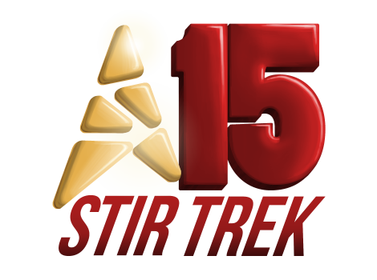

# Stir Trek - GenerativeAI
This is the repo for the May 4th 2024 All day Workshop for Stir Trek in Columbus, Ohio.

## Presenters
|Lino Tadros|Carey Payette|
|---|---|
|||
|[LinkedIn](https://www.linkedin.com/in/linotadros/)|[LinkedIn](https://www.linkedin.com/in/careypayette/)|

## Introduction
“Generative AI is easy!” Look at ChatGPT, you ask a question, you get an answer! How difficult could it be?
Well, for you as an individual, it is very easy and simple to use, but for an enterprise to allow the use of Generative AI, it is very involved to make sure all the pieces involved are secure, scalable, and extensible. There are servers, clusters, APIs, Agents, Datasources, Prompts, Orchestrators, Embedding Models, Vectorization Databases, and many other endpoints that must be put in place and secured to provide reliable answers to questions using Generative AI in a private and secure setting for an organization.

## Day Agenda

|Time Slot|Description|
|---|---|
|10:00 - 10:15|Introductions|
|10:15 - 10:45|Introduction to Generative AI|
|10:45 - 11:00|Break|
|11:00 - 11:30|Working with OpenAI using API|
|11:30 - 12:00|Lab 1 Working with OpenAI using API|
|12:00 - 1:00|Lunch|
|1:00 - 1:30|Semantic Kernel Fundamentals|
|1:30 - 2:00|Lab 2 Semantic Kernel Fundamentals|
|2:00 - 2:15|Break|
|2:15 - 2:45|Langchain Fundamentals|
|2:45 - 3:15|Lab 3 Langchain Fundamentals|
|3:15 - 3:45|RAG Fundamentals|
|3:45 - 4:15|Lab 4 RAG Fundamentals|
|4:15 - 4:45|Embeddings & Vectorization|
|4:45 - 5:00|Lab 5 Embeddings and Vectorization and final wrap up.|

## I hope you enjoyed the Workshop!
### Looking forward to seeing you in next year's StirTrek!